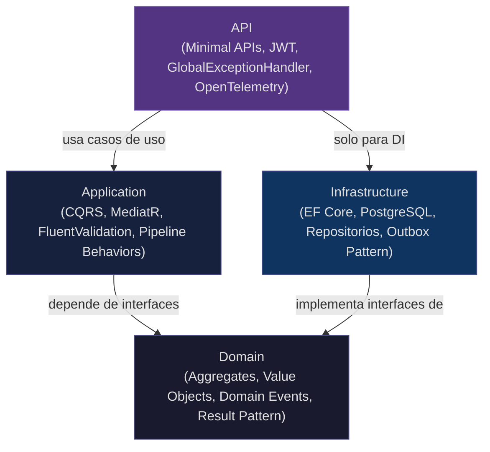
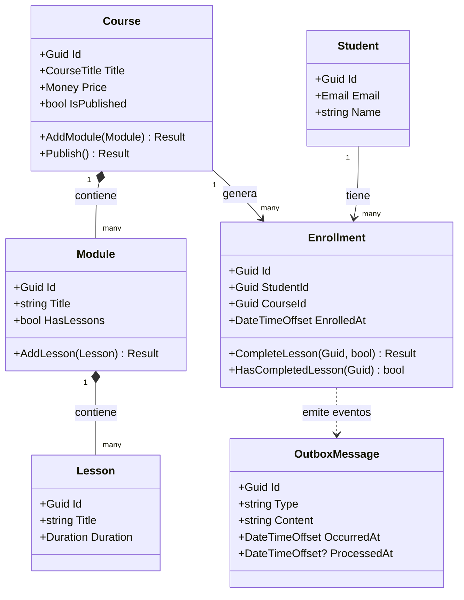
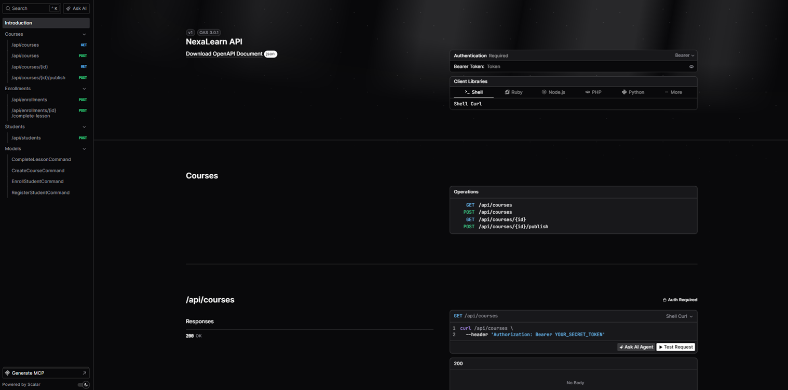

# nexa-learn

[](https://github.com/alejandroachinelli/nexa-learn/actions/workflows/ci.yml)
[](https://dotnet.microsoft.com/en-us/download/dotnet/8.0)
[](#setup-local)
[](https://www.postgresql.org/)

Proyecto fundacional de mi portfolio técnico. El objetivo no es resolver un problema de negocio
complejo, sino demostrar dominio de **C# moderno**, **arquitectura limpia** y **buenas prácticas
de ingeniería de software** con .NET 8.

Elegí el dominio de una plataforma de cursos porque es simple de entender para cualquier evaluador,
pero rico en reglas de negocio reales: un curso no puede publicarse sin módulos, una inscripción
no puede existir en un curso no publicado, un estudiante no puede inscribirse dos veces al mismo
curso. Esas restricciones permiten demostrar todos los patrones que me interesan sin que el
evaluador tenga que aprender un dominio específico de negocio.

Un evaluador técnico puede navegar este repositorio y entender, en menos de 30 minutos, cómo
tomo decisiones de diseño, cómo estructuro el código y cómo razono sobre la separación de
responsabilidades.

---

## Arquitectura

El proyecto usa **Clean Architecture** con cuatro capas. La regla central es simple: las
dependencias siempre apuntan hacia adentro. El dominio no sabe que existe EF Core. Los casos
de uso no saben si la API es REST o gRPC.



La clave está en que `Infrastructure` implementa interfaces definidas en `Domain`. El dominio
define el contrato que necesita (`ICourseRepository`), y la infraestructura lo satisface. Si
mañana cambiamos de PostgreSQL a MongoDB, solo tocamos Infrastructure.

---

## Modelo de dominio



Los aggregates están desacoplados entre sí: `Enrollment` no referencia objetos `Course` ni
`Student` directamente. Recibe `Guid` y `bool` porque un aggregate no debe cruzar la frontera
de otro. Esta es una decisión deliberada de DDD documentada en el ADR-001.

---

## Patrones implementados

| Patrón | Estado | Por qué existe |
|---|---|---|
| **Clean Architecture** | ✅ | Hace explícita la dirección de dependencias. Un evaluador entiende la arquitectura navegando las carpetas, sin leer documentación. |
| **Result Pattern** | ✅ | Los errores de negocio son ciudadanos de primera clase del sistema de tipos. `Result<Enrollment>` documenta qué puede fallar mejor que un try-catch. |
| **Value Objects** | ✅ | Un `Email` no puede existir inválido. Un `Money` negativo no puede crearse. La validación está en la construcción, no dispersa. |
| **Domain Events** | ✅ | `CoursePublished`, `StudentEnrolled`, `LessonCompleted` son hechos del negocio con nombre explícito y tipo propio. |
| **Outbox Pattern** | ✅ | Los domain events se persisten en la misma transacción que el aggregate. Ningún evento se pierde si el proceso falla entre el commit y el dispatch. |
| **CQRS con MediatR** | ✅ | Separa la intención de leer de la intención de escribir. Los handlers son los casos de uso: pequeños, testeables y sin dependencias cruzadas. |
| **Repository + Unit of Work** | ✅ | El dominio define qué necesita (`ICourseRepository`). La infraestructura decide cómo lo satisface. Los tests de Application usan repos en memoria. |
| **Pipeline Behaviors** | ✅ | Logging y validación de todos los handlers sin tocar los handlers. Cross-cutting concerns sin herencia ni duplicación. |
| **GlobalExceptionHandler** | ✅ | Toda excepción no manejada retorna `ProblemDetails` (RFC 7807) con status 500. El stack trace nunca llega al cliente. |
| **OpenTelemetry** | ✅ | Instrumentación de ASP.NET Core, HTTP client y EF Core. Exporter a consola en Development. Listo para conectar Jaeger o Tempo en producción. |
| **GitHub Actions CI** | ✅ | Build + tests en cada push y pull request. Domain y Application tests sin Docker. Infrastructure tests con Testcontainers sobre Ubuntu. |

---

## API en acción

```bash
dotnet run --project src/NexaLearn.Api --launch-profile http
# Documentación disponible en http://localhost:5152/scalar/v1
```



Documentación interactiva generada automáticamente desde los endpoints. Permite probar todos
los endpoints directamente desde el browser.

| Método | Ruta | Auth | Descripción |
|---|---|---|---|
| GET | `/api/courses` | No | Lista cursos publicados |
| GET | `/api/courses/{id}` | No | Obtiene un curso por ID |
| POST | `/api/courses` | JWT | Crea un curso |
| POST | `/api/courses/{id}/publish` | JWT | Publica un curso |
| POST | `/api/students` | No | Registra un estudiante |
| POST | `/api/enrollments` | JWT | Inscribe un estudiante en un curso |
| POST | `/api/enrollments/{id}/complete-lesson` | JWT | Marca una lección como completada |

---

## Setup local

Requisitos: .NET 8 SDK, Docker Desktop.

```bash
docker-compose -f docker/docker-compose.yml up -d
dotnet test NexaLearn.slnx
dotnet run --project src/NexaLearn.Api --launch-profile http
```

```
dotnet test NexaLearn.slnx

Pruebas totales: 211
     Correcto: 211
 Tiempo total: < 1 segundo (Domain + Application) + ~35s (Infrastructure con Docker)
```

---

## Estado de las etapas

| Etapa | Contenido | Estado |
|---|---|---|
| **Etapa 1 — Domain layer** | Aggregates, Value Objects, Result Pattern, Domain Events, interfaces de repositorio | ✅ Completa — 118 tests |
| **Etapa 2 — Application layer** | CQRS con MediatR, commands, queries, validators, Pipeline Behaviors, DTOs | ✅ Completa — 80 tests |
| **Etapa 3 — Infrastructure** | EF Core 8, PostgreSQL 16, repositorios concretos, Testcontainers | ✅ Completa — 13 tests con Postgres real |
| **Etapa 4 — API** | Minimal APIs, JWT Bearer, Scalar docs, GlobalExceptionHandler | ✅ Completa — 7 endpoints |
| **Etapa 5 — Observabilidad y CI** | OpenTelemetry, Outbox Pattern, GitHub Actions | ✅ Completa |

---

## Estructura del proyecto

```
nexa-learn/
├── src/
│   ├── NexaLearn.Domain/               # Zero dependencias externas
│   │   ├── Aggregates/
│   │   │   ├── Courses/                # Course (raíz), Module, Lesson
│   │   │   │   └── Events/             # CoursePublished
│   │   │   ├── Students/               # Student
│   │   │   └── Enrollments/            # Enrollment
│   │   │       └── Events/             # StudentEnrolled, LessonCompleted
│   │   ├── ValueObjects/               # Email, CourseTitle, Duration, Money
│   │   └── Common/                     # Entity<T>, AggregateRoot<T>, ValueObject, Result<T>, IHasDomainEvents
│   │
│   ├── NexaLearn.Application/          # Casos de uso — solo conoce Domain
│   │   ├── Courses/Commands/           # CreateCourse, PublishCourse
│   │   ├── Courses/Queries/            # GetCourseById, ListPublishedCourses
│   │   ├── Enrollments/Commands/       # EnrollStudent, CompleteLesson
│   │   ├── Students/Commands/          # RegisterStudent
│   │   └── Common/Behaviors/           # LoggingBehavior, ValidationBehavior
│   │
│   ├── NexaLearn.Infrastructure/       # Implementaciones concretas
│   │   ├── Persistence/                # EF Core DbContext, Configurations
│   │   ├── Persistence/Repositories/   # Repos concretos
│   │   ├── Persistence/Migrations/     # Historial de esquema
│   │   └── Persistence/Outbox/         # OutboxMessage, OutboxInterceptor
│   │
│   └── NexaLearn.Api/                  # Superficie pública
│       ├── Endpoints/                  # CourseEndpoints, StudentEndpoints, EnrollmentEndpoints
│       └── Middleware/                 # GlobalExceptionHandler
│
├── tests/
│   ├── NexaLearn.Domain.Tests/         # Tests unitarios puros — sin EF, sin HTTP
│   ├── NexaLearn.Application.Tests/    # Handlers con repos in-memory
│   └── NexaLearn.Infrastructure.Tests/ # Tests de integración con Testcontainers
│
├── docs/
│   ├── adr/                            # Architecture Decision Records
│   ├── guides/                         # Guías técnicas de decisiones
│   └── spec.md                         # Spec completa del proyecto
│
└── docker/
    └── docker-compose.yml              # PostgreSQL + pgAdmin
```

---

## Lo que aprendí

**Result Pattern en lugar de excepciones para flujo de negocio**

Cuando empecé a aplicarlo me generó más código. Después me di cuenta de que el compilador me
obliga a manejar el error en cada llamada. Con excepciones, el error puede propagarse silenciosamente
a través de diez capas antes de que alguien lo capture. Con `Result<T>`, si no verifico
`result.IsFailure`, el valor incorrecto llega al paso siguiente y el test falla ahí mismo,
no en producción a las 3am.

**Aggregates que no se referencian entre sí**

`Enrollment` recibe `bool courseIsPublished` en lugar de un objeto `Course`. La primera vez que
lo vi me pareció raro. El motivo es que si `Enrollment` tuviera una referencia directa a `Course`,
cualquier cambio en el aggregate `Course` podría afectar `Enrollment`. Los aggregates son unidades
de consistencia independientes. El Application layer es quien coordina la información entre ellos.

**Outbox Pattern como consecuencia natural del modelo de dominio**

El problema no es técnico: es que guardar el aggregate y publicar el evento son dos operaciones
separadas, y entre ellas el proceso puede fallar. La solución no es "reintentar el evento" sino
no salir de la transacción hasta que el evento esté persistido. El interceptor de EF Core es el
lugar correcto para esto: está entre el código de negocio y la base de datos, ve todos los
cambios antes de que se confirmen, y puede agregar los mensajes de outbox en la misma transacción
sin que ningún handler tenga que saber que existe.

**`where TId : notnull` en Entity<TId>**

Un detalle que parece menor pero que aprendí de un bug real: sin esa constraint, nada impide
crear una entidad con `Id = null`. Eso funciona hasta que la entidad entra en un diccionario
o colección que usa `GetHashCode`, y entonces explota en runtime. La constraint mueve ese error
a tiempo de compilación.

**HasMany vs OwnsMany en EF Core**

EF Core tiene una limitación conocida con `OwnsMany` + backing fields privados + `PropertyAccessMode.Field`:
al agregar entidades nuevas a una colección ya trackeada, las marca como `Modified` en lugar de
`Added`, generando `UPDATE` en vez de `INSERT`. La solución fue cambiar a `HasMany` con cascade
delete. El esquema de base de datos es idéntico, pero el comportamiento de change tracking es el
estándar. Esta decisión está documentada en el ADR-002.

---

## Documentación técnica

**Architecture Decision Records:**
- [ADR-001](docs/adr/001-decisiones-arquitectura-base.md) — Clean Architecture, Result Pattern, Minimal APIs, mapeo explícito, JWT
- [ADR-002](docs/adr/002-ef-core-sin-dapper.md) — EF Core como único ORM, HasMany vs OwnsMany

**Guías técnicas:**
- [Guía 001](docs/guides/001-tipos-de-tests.md) — Tipos de tests y qué testea cada capa
- [Guía 002](docs/guides/002-cqrs-y-mediatr.md) — CQRS con MediatR: commands, queries, handlers
- [Guía 003](docs/guides/003-ef-core-vs-dapper.md) — Cuándo usar EF Core y cuándo Dapper
- [Guía 004](docs/guides/004-ef-core-materialization.md) — Materialización de entidades en EF Core
- [Guía 005](docs/guides/005-controllers-vs-minimal-apis.md) — Controllers vs Minimal APIs: cuándo usar cada uno
- [Guía 006](docs/guides/006-ienumerable-vs-iqueryable.md) — IEnumerable vs IQueryable: la pregunta más frecuente en entrevistas .NET

---

## Stack

| Tecnología | Versión | Uso |
|---|---|---|
| .NET | 8 LTS | Runtime y SDK |
| PostgreSQL | 16 | Base de datos principal |
| EF Core | 8 | ORM con Fluent API |
| MediatR | — | Dispatcher de CQRS |
| FluentValidation | — | Validación de commands |
| xUnit + FluentAssertions | 7 | Tests unitarios e integración |
| Testcontainers | — | Tests de integración con Postgres real |
| Scalar | — | Documentación OpenAPI interactiva |
| OpenTelemetry | 1.15.x | Tracing distribuido |
| GitHub Actions | — | CI/CD |
