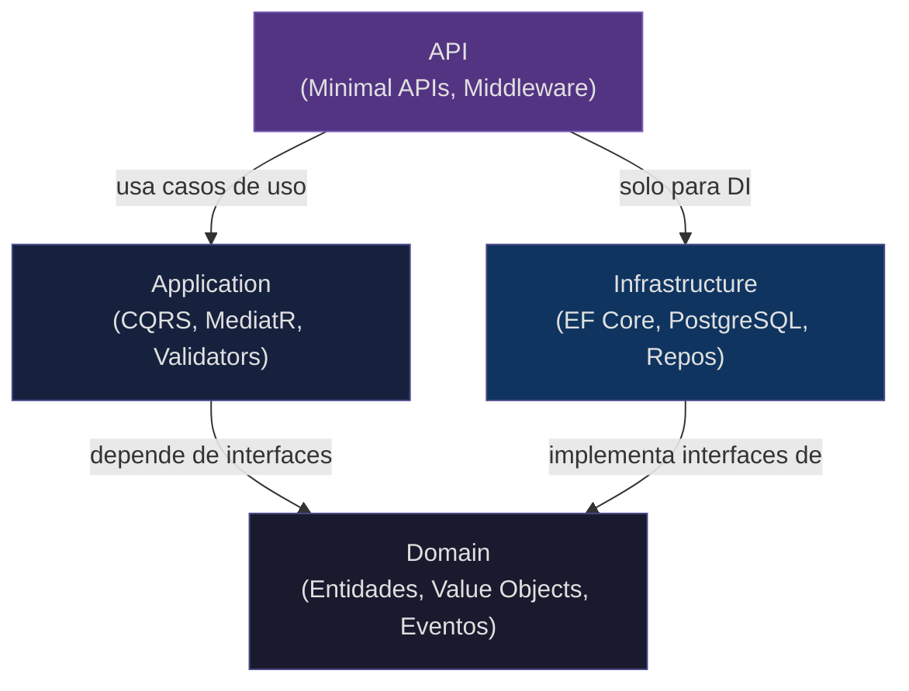
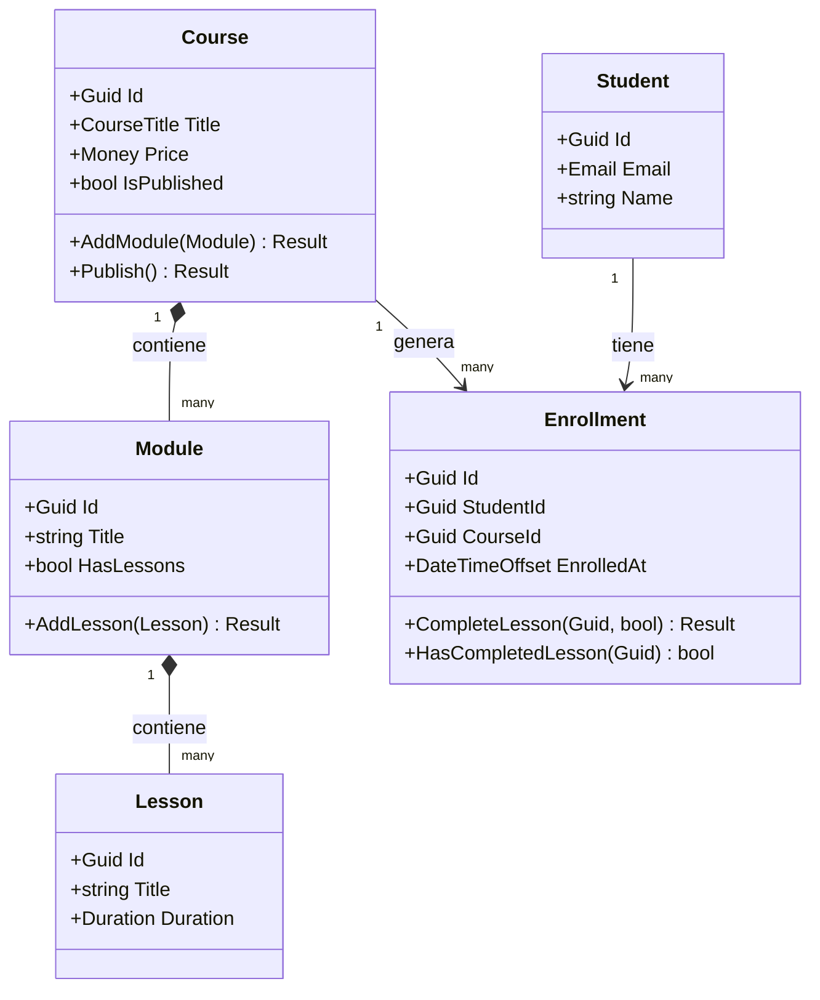

# nexa-learn

Proyecto fundacional de mi portfolio técnico. El objetivo no es resolver
un problema de negocio complejo, sino demostrar dominio de **C# moderno**,
**arquitectura limpia** y **buenas prácticas de ingeniería de software** con .NET 8.

Un evaluador técnico puede navegar este repositorio y entender, en menos de
30 minutos, cómo tomo decisiones de diseño, cómo estructuro el código y cómo
razono sobre la separación de responsabilidades.

El dominio elegido es una plataforma de gestión de cursos de aprendizaje.
Es simple de entender, rico en reglas de negocio, y permite demostrar
todos los patrones que me interesan sin que el evaluador tenga que entender
un negocio específico.

---

## Arquitectura

El proyecto usa **Clean Architecture** con cuatro capas. La regla central
es simple: las dependencias siempre apuntan hacia adentro. El dominio no
sabe que existe EF Core. Los casos de uso no saben si la API es REST o gRPC.



La clave está en que `Infrastructure` implementa interfaces definidas en
`Domain`. Esto significa que el dominio define el contrato que necesita
(`ICourseRepository`), y la infraestructura lo satisface. Si mañana
queremos cambiar de PostgreSQL a MongoDB, solo tocamos Infrastructure.

---

## Modelo de dominio



Los aggregates están desacoplados entre sí: `Enrollment` no referencia
objetos `Course` ni `Student` directamente. Recibe `Guid` y `bool` porque
un aggregate no debe cruzar la frontera de otro. Esta es una decisión
deliberada de DDD que aparece documentada en el ADR-001.

---

## Patrones implementados

| Patrón | Por qué existe |
|---|---|
| **Clean Architecture** | Hace explícita la dirección de dependencias. Un evaluador puede entender la arquitectura navegando las carpetas, sin leer documentación. |
| **Result Pattern** | Los errores de negocio son ciudadanos de primera clase del sistema de tipos. `Result<Enrollment>` documenta qué puede fallar mejor que un try-catch. |
| **Value Objects** | Un `Email` no puede existir inválido. Un `Money` negativo no puede crearse. La validación está en la construcción, no dispersa en el código. |
| **Domain Events** | `CoursePublished`, `StudentEnrolled`, `LessonCompleted` son hechos del negocio con nombre explícito. El dispatch llega en Etapa 5. |
| **CQRS con MediatR** | Separa la intención de leer de la intención de escribir. Los handlers son los casos de uso: pequeños, testeables y sin dependencias cruzadas. _(Etapa 2)_ |
| **Repository + Unit of Work** | El dominio define qué necesita (`ICourseRepository`). La infraestructura decide cómo lo satisface. Los tests de Application usan repos en memoria. _(Etapa 3)_ |
| **Options Pattern** | La configuración de infraestructura es explícita, validada en startup y nunca hardcodeada. _(Etapa 3)_ |
| **Decorator (Pipeline Behaviors)** | Logging y validación de todos los handlers sin tocar los handlers. Cross-cutting concerns sin herencia. _(Etapa 4)_ |
| **Outbox Pattern** | Los domain events se persisten en la misma transacción que la operación. Ningún evento se pierde si el proceso falla entre el commit y el dispatch. _(Etapa 5)_ |

---

## Estructura del proyecto

```
nexa-learn/
├── src/
│   ├── NexaLearn.Domain/               # Zero dependencias externas
│   │   ├── Aggregates/
│   │   │   ├── Courses/                # Course (raíz), Module, Lesson
│   │   │   │   └── Events/             # CoursePublished
│   │   │   ├── Students/               # Student
│   │   │   └── Enrollments/            # Enrollment
│   │   │       └── Events/             # StudentEnrolled, LessonCompleted
│   │   ├── ValueObjects/               # Email, CourseTitle, Duration, Money
│   │   ├── Common/                     # Entity<T>, AggregateRoot<T>, ValueObject, Result<T>
│   │   └── Interfaces/                 # Contratos de repositorio (sin EF, sin Npgsql)
│   │
│   ├── NexaLearn.Application/          # Casos de uso — solo conoce Domain
│   │   ├── Courses/Commands/           # CreateCourse, PublishCourse
│   │   ├── Courses/Queries/            # GetCourseById, ListPublishedCourses
│   │   ├── Enrollments/Commands/       # EnrollStudent, CompleteLesson
│   │   ├── Enrollments/Queries/        # GetStudentProgress
│   │   ├── Students/Commands/          # RegisterStudent
│   │   └── Common/Behaviors/           # LoggingBehavior, ValidationBehavior
│   │
│   ├── NexaLearn.Infrastructure/       # Implementaciones concretas
│   │   ├── Persistence/                # EF Core DbContext, Configurations
│   │   ├── Persistence/Repositories/   # Repos concretos
│   │   ├── Persistence/Migrations/     # Historial de esquema
│   │   └── Outbox/                     # Worker de domain events
│   │
│   └── NexaLearn.Api/                  # Superficie pública
│       ├── Endpoints/                  # CourseEndpoints, StudentEndpoints, EnrollmentEndpoints
│       └── Middleware/                 # GlobalExceptionHandler
│
├── tests/
│   ├── NexaLearn.Domain.Tests/         # Tests unitarios puros — sin EF, sin HTTP
│   ├── NexaLearn.Application.Tests/    # Handlers con repos in-memory
│   └── NexaLearn.Infrastructure.Tests/ # Tests de integración con Testcontainers
│
├── docs/
│   ├── adr/                            # Architecture Decision Records
│   ├── spec.md                         # Spec completa del proyecto
│   └── plan.md                         # Plan de tareas por etapa
│
└── docker/
    └── docker-compose.yml              # PostgreSQL + pgAdmin
```

---

## Estado actual

| Etapa | Contenido | Estado |
|---|---|---|
| **Etapa 1 — Domain layer** | Entidades, Value Objects, Result Pattern, Domain Events, interfaces de repositorio | **Completa — 118 tests en verde** |
| **Etapa 2 — Application layer** | CQRS con MediatR, commands, queries, validators, DTOs | **Completa — 198 tests en verde** |
| **Etapa 3 — Infrastructure** | EF Core, PostgreSQL, repositorios concretos, Testcontainers | **Completa — 13 tests con PostgreSQL real via Testcontainers** |
| **Etapa 4 — API + seguridad** | Minimal APIs, JWT, Pipeline Behaviors, manejo de errores | **Completa — API REST con 7 endpoints, Scalar docs, JWT auth, GlobalExceptionHandler** |
| **Etapa 5 — Observabilidad** | Outbox Pattern, OpenTelemetry, GitHub Actions CI | Pendiente |

```
dotnet test NexaLearn.slnx

Pruebas totales: 211
     Correcto: 211
 Tiempo total: < 1 segundo (Domain + Application) + ~35s (Infrastructure con Docker, requiere Docker Desktop)
```

---

## API en acción

Con la API corriendo en desarrollo, la documentación interactiva está disponible en:

```
http://localhost:5152/scalar/v1
```

Endpoints disponibles:

| Método | Ruta | Auth | Descripción |
|---|---|---|---|
| GET | `/api/courses` | No | Lista cursos publicados |
| GET | `/api/courses/{id}` | No | Obtiene un curso por ID |
| POST | `/api/courses` | JWT | Crea un curso |
| POST | `/api/courses/{id}/publish` | JWT | Publica un curso |
| POST | `/api/students` | No | Registra un estudiante |
| POST | `/api/enrollments` | JWT | Inscribe un estudiante en un curso |
| POST | `/api/enrollments/{id}/complete-lesson` | JWT | Marca una lección como completada |

---

## Setup local

Requisitos: .NET 8 SDK, Docker Desktop.

```bash
# Levantar PostgreSQL y pgAdmin
docker-compose -f docker/docker-compose.yml up -d

# Correr los tests
dotnet test NexaLearn.slnx

# Correr la API
dotnet run --project src/NexaLearn.Api --launch-profile http
```

---

## Decisiones técnicas que me resultaron más interesantes

**Result Pattern en lugar de excepciones para flujo de negocio**

Cuando empecé a aplicarlo me generó más código. Después me di cuenta de
que el compilador me obliga a manejar el error en cada llamada. Si llamo
a `Enrollment.Create(...)` y no verifico `result.IsFailure`, el compilador
no me avisa, pero los tests sí. Con excepciones, el error puede propagarse
silenciosamente a través de diez capas antes de que alguien lo capture.

**Value Objects con factory methods estáticos**

La decisión de usar `Email.Create(string)` retornando `Result<Email>` en lugar
de un constructor que lanza excepciones parece burocrática al principio.
El beneficio real es que en cualquier parte del código donde aparece un `Email`,
sabés que es válido. No hay que ir a buscar dónde se valida ni confiar en que
alguien lo hizo antes.

**Aggregates que no se referencian entre sí**

`Enrollment` recibe `bool courseIsPublished` en lugar de un objeto `Course`.
La primera vez que lo vi me pareció raro. El motivo es que si `Enrollment`
tuviera una referencia directa a `Course`, cualquier cambio en el aggregate
`Course` podría afectar `Enrollment`. Los aggregates son unidades de
consistencia independientes. El application layer es quien coordina.

**`where TId : notnull` en Entity<TId>**

Un detalle que parece menor pero que aprendí de un bug real: sin esa
constraint, nada impide crear una entidad con `Id = null`. Eso funciona
hasta que la entidad entra en un diccionario o colección que usa `GetHashCode`,
y entonces explota en runtime. La constraint mueve ese error a tiempo de
compilación.

---

## ADRs

Las decisiones de arquitectura están documentadas en `docs/adr/`:

- [ADR-001](docs/adr/001-decisiones-arquitectura-base.md) — Dominio, Clean Architecture,
  Minimal APIs, Result Pattern, mapeo explícito, JWT diferido

---

## Stack

- **.NET 8** — LTS vigente
- **PostgreSQL 16** — base de datos principal (Etapa 3)
- **EF Core 8** con Fluent API (Etapa 3)
- **MediatR** — dispatcher de CQRS (Etapa 2)
- **FluentValidation** — validación de commands (Etapa 2)
- **xUnit + FluentAssertions 7** — tests
- **Testcontainers** — tests de integración con Postgres real (Etapa 3)
- **OpenTelemetry** — trazabilidad (Etapa 5)
